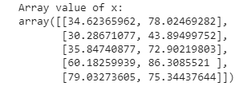
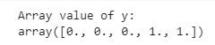
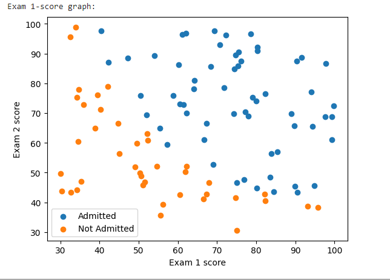
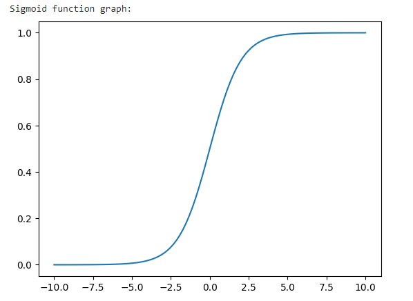
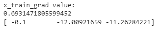
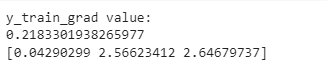
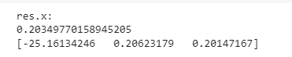
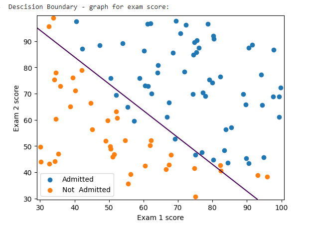
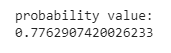
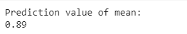

# Implementation-of-Logistic-Regression-Using-Gradient-Descent

## AIM:
To write a program to implement the the Logistic Regression Using Gradient Descent.

## Equipments Required:
1. Hardware – PCs
2. Anaconda – Python 3.7 Installation / Jupyter notebook

## Algorithm
1. Import dataset
2. Check for null and duplicate values
3. Assign x and y values
4. Split data into train and test data
5. Import logistic regression and fit the training data
6. Predict y value
7. Calculate accuracy and confusion matrix


## Program:
```
Program to implement the the Logistic Regression Using Gradient Descent.
Developed by: Ritika S
RegisterNumber:  212221240046

import numpy as np
import matplotlib.pyplot as plt
from scipy import optimize

data = np.loadtxt("/content/ex2data1 (2).txt", delimiter=',')
x = data[:, [0,1]]
y = data[:, 2]

print("Array value of x:")
x[:5]

print("Array value of y:")
y[:5]

print("Exam 1-score graph:")
plt.figure()
plt.scatter(x[y == 1][:,0], x[y == 1][:, 1], label="Admitted")
plt.scatter(x[y == 0][:,0], x[y == 0][:, 1], label="Not Admitted")
plt.xlabel("Exam 1 score")
plt.ylabel("Exam 2 score")
plt.legend()
plt.show()

def sigmoid(z):
    return 1 / (1 + np.exp(-z))
    
print("Sigmoid function graph: ")
plt.plot()
x_plot = np.linspace(-10, 10, 100)
plt.plot(x_plot, sigmoid(x_plot))
plt.show()

def costFunction(theta, x, y):
    h = sigmoid(np.dot(x, theta))
    J = -(np.dot(y, np.log(h)) + np.dot(1 - y, np.log(1 - h))) / x.shape[0]
    grad = np.dot(x.T, h - y) / x.shape[0]
    return J, grad 
    
x_train = np.hstack((np.ones((x.shape[0], 1)), x))
theta = np.array([0, 0, 0])
J,grad = costFunction(theta, x_train, y) 
print("x_train_grad value:")
print(J)
print(grad)

x_train  =  np.hstack((np.ones((x.shape[0], 1)), x)) 
theta = np.array([-24, 0.2, 0.2])
J, grad = costFunction(theta, x_train, y)
print("y_train_grad value:")
print(J)
print(grad)

def cost(theta, x, y):
    h = sigmoid(np.dot(x, theta))
    J = - (np.dot(y, np.log(h)) + np.dot(1 - y, np.log(1 - h))) / x.shape[0]
    return J
    
def gradient(theta, x, y):
    h = sigmoid(np.dot(x, theta))
    grad = np.dot(x.T, h - y) / x.shape[0]
    return grad
    
x_train = np.hstack((np.ones((x.shape[0], 1)), x))
theta = np.array([0, 0, 0])
res = optimize.minimize(fun=cost, x0=theta, args=(x_train, y),
                        method='Newton-CG', jac=gradient)
print("res.x:")
print(res.fun)
print(res.x)

def plotDecisionBoundary(theta, x, y):
    x_min, x_max = x[:, 0].min() -1, x[:, 0].max() + 1
    y_min, y_max = x[:, 1].min() -1, x[:, 1].max() + 1
    xx, yy = np.meshgrid(np.arange(x_min, x_max, 0.1),
                         np.arange(y_min, y_max, 0.1))
    x_plot = np.c_[xx.ravel(), yy.ravel()]
    x_plot = np.hstack((np.ones((x_plot.shape[0], 1)), x_plot))
    y_plot = np.dot(x_plot, theta).reshape(xx.shape)

    plt.figure()
    plt.scatter(x[y == 1][:, 0], x[y == 1][:, 1], label="Admitted")
    plt.scatter(x[y == 0][:, 0], x[y == 0][:, 1], label="Not  Admitted")
    plt.contour(xx, yy, y_plot, levels=[0])
    plt.xlabel("Exam 1 score")
    plt.ylabel("Exam 2 score")
    plt.legend()
    plt.show()

print("Descision Boundary - graph for exam score:")
plotDecisionBoundary(res.x, x,y)

print("probability value:")
prob = sigmoid(np.dot(np.array([1, 45, 85]), res.x))
print(prob)

def predict(theta, x):
  x_train = np.hstack((np.ones((x.shape[0], 1)), x))
  prob = sigmoid(np.dot(x_train, theta))
  return (prob >= 0.5).astype(int)
  
print("Prediction value of mean:")
np.mean(predict(res.x, x)  == y)

```

## Output:
### 1. Array Value of x


### 2. Array Value of y


### 3. Exam 1 - score graph


### 4. Sigmoid function graph


### 5. X_train_grad value


### 6. Y_train_grad value


### 7. Print res.x


### 8. Decision boundary - graph for exam score


### 9. Proability value 


### 10. Prediction value of mean



## Result:
Thus the program to implement the the Logistic Regression Using Gradient Descent is written and verified using python programming.

